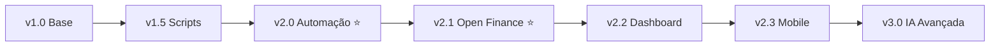

# 🤖 Agente Financeiro IA v2.3

> **Sistema inteligente de automação financeira com 98.2% de precisão + Dashboard Interativo + Open Finance**

Sistema Python avançado que automatiza completamente o processamento de extratos bancários, cartões de crédito e PIX, utilizando machine learning para categorização inteligente, **integração Open Finance via Pluggy**, dashboard interativo com análise visual, e gerando relatórios consolidados prontos para análise.

[](https://python.org)
[](https://sqlite.org)
[](README.md)
[](tests/)
[](docs/Testing/003_SEMANA2_PRONTIDAO.md)
[](htmlcov/index.html)
[](LICENSE)
[](docs/Integracao_PROXIMO_CHAT.md)
[](docs/README.md)

---

## 🎉 NOVIDADES v2.3.0 - DASHBOARD INTERATIVO!

🚀 **DASHBOARD COMPLETO** - Visualização interativa com análise em tempo real:

```
📊 DASHBOARD FEATURES
├─ 6 cards compactos (Total, Média 12M, Categorizado, Pendentes, Transações, Meses)
├─ Categorização inline (categorizar "A definir" direto no dashboard)
├─ Filtros dinâmicos (Mês, Categoria, Fonte) com refresh automático
├─ 7 gráficos interativos (Real vs Ideal, Evolução, Fontes, etc.)
├─ Valores normalizados (14.4k ao invés de R$ 14.400)
├─ Cores inteligentes (verde=economizou, vermelho=excedeu)
├─ Fontes otimizadas para tela QHD (10-24pt configuráveis)
└─ Ferramentas Plotly (zoom, pan, download PNG, reset)
```

**🎯 Script:** `backend/src/dashboard_dash.py`  
**🌐 Acesso:** http://localhost:8050  
**📊 Dados:** 2.096 transações • 97.2% categorizadas • R$ 328k total

---

## 📈 NOVIDADE v2.2.0 - EXCEL OPEN FINANCE!

🚀 **AVANÇO GIGANTE** - Geração completa de Excel consolidado a partir de dados reais do Open Finance:

```
📊 RESULTADOS NOVEMBRO 2025 (19/10 a 18/11)
├─ 141 transações processadas (3 contas Itaú)
├─ 83% categorização automática (117/141)
├─ 33 parcelas identificadas (1/3, 2/5, etc.)
├─ 13 moedas estrangeiras convertidas (USD → BRL)
├─ R$ -12.391,35 em débitos | R$ -9.579,96 em créditos
└─ Formato 100% compatível com consolidado_temp.xlsx
```

**🎯 Script:** `backend/src/gerar_excel_pluggy.py`  
**📄 Output:** `dados/planilhas/consolidado_pluggy_nov2025.xlsx`  
**🔒 Segurança:** Somente leitura (OAuth2) - sem operações de escrita

---

## 🏆 **Performance Atual**

### 🎯 Produção (v2.2)

- ✅ **98.2% de precisão** na categorização automática (1759/1791 transações)
- ✅ **584 categorias** otimizadas após limpeza de duplicatas
- ✅ **Automação completa** com interface menu Windows
- ✅ **Processamento inteligente** de múltiplas fontes simultâneas
- 🆕 **Excel Open Finance** - Geração automática de consolidado com dados reais
- 🆕 **Open Finance integrado** - Acesso automatizado a dados bancários via Pluggy
- 🆕 **Documentação profissional** - Reorganização completa com padrão de mercado

### 🧪 Qualidade (Semana 2 - Concluída)

- ✅ **127 testes implementados** (119 passing, 8 to fix)
- ✅ **35.34% de cobertura** de código (meta: 70%)
- ✅ **Infraestrutura completa** de testes com pytest
- 🔧 **94% funcional** - [Ver status detalhado](docs/Testing/003_SEMANA2_PRONTIDAO.md)

### 🔗 Integração Open Finance (Novo!)

- ✅ **Pluggy conectado** - Mercado Pago + Sandbox ativos
- ✅ **REST API funcional** - Autenticação, contas, transações, identidade
- ✅ **Dados reais recuperados** - Saldo, transações com categoria automática
- 🔄 **Em desenvolvimento** - Sincronização automática e expansão para Itaú
- 📖 **[Guia Completo](docs/Integracao_PROXIMO_CHAT.md)** - Contexto rápido e roadmap

## 🚀 **Funcionalidades**

### 🤖 **Processamento Automático**

- ✅ **Múltiplas fontes**: Itaú, Latam, PIX (extensível para novos bancos)
- ✅ **Formatos diversos**: XLS, XLSX, TXT, CSV com detecção automática
- ✅ **Detecção inteligente** de tipos de cartão (Master/Visa, físico/virtual)
- ✅ **Busca automática** de arquivos dos últimos 12 meses
- ✅ **Interface de automação** com menus .bat para Windows

### 🧠 **Sistema de Aprendizado**

- ✅ **Categorização automática** com ML atingindo 98.2% de precisão
- ✅ **Mapeamento dinâmico** descrição → categoria com 584 padrões otimizados
- ✅ **Aprendizado contínuo** com feedback do usuário via Excel
- ✅ **Base de conhecimento** persistente em SQLite com limpeza automática
- ✅ **Proteção contra duplicatas** com padrões de data inteligentes

### 📊 **Análise e Relatórios**

- ✅ **Dashboard Interativo** (Dash + Plotly) com categorização inline 🆕
- ✅ **Consolidação temporal** ordenada por MesComp, Fonte desc e Data
- ✅ **Exportação Excel** com formatação limpa (Master/Visa sem prefixos)
- ✅ **Identificação de padrões** de gastos e anomalias
- ✅ **Filtros inteligentes** para moedas estrangeiras e duplicatas
- ✅ **Estatísticas de performance** do sistema de categorização
- ✅ **7 gráficos interativos** (barras, pizza, evolução temporal) 🆕

### 🔧 **Tratamento de Dados**

- ✅ **Normalização automática** de descrições e valores
- ✅ **Conversão de moedas** e padronização de formatos
- ✅ **Detecção de anomalias** com validação de dados
- ✅ **Backup automático** com versionamento no SQLite
- ✅ **Limpeza inteligente** de categorias duplicadas

### 🔗 **Integração Open Finance (Beta)** 🆕

- ✅ **Acesso automatizado** a dados bancários via Open Finance Brasil
- ✅ **Pluggy integrado** - Agregador certificado pelo Banco Central
- ✅ **OAuth2 seguro** - Sem compartilhar senha do banco
- ✅ **Múltiplas contas** - Mercado Pago funcionando, Itaú em teste
- 🔄 **Sincronização automática** - Importação de transações sem planilhas
- 📖 **Compliance LGPD** - Regulado pelo BCB, certificações ISO 27001/PCI DSS
- 🔐 **[Ver documentação completa](docs/Integracao_PROXIMO_CHAT.md)**

## 📁 **Estrutura do Projeto**

```
Financeiro/
├── config/                            # ⚙️ Configurações centralizadas
│   ├── config.ini                     # 🔐 Credenciais (não versionado)
│   └── config.example.ini             # 📋 Template de configuração
│
├── backend/src/                       # 🚀 Scripts principais
│   ├── agente_financeiro.py           # 🤖 Processador principal (98.2% precisão)
│   ├── atualiza_dicionario.py         # 📚 Atualiza base de Excel consolidado
│   ├── atualiza_dicionario_controle.py # 📋 Sync com Controle_pessoal.xlsm
│   ├── limpar_categorias.py           # 🧹 Limpeza de duplicatas inteligente
│   ├── /integrations/                 # 🔗 Integrações externas
│   │   ├── pluggy_client.py           # 🏦 Cliente Open Finance (Pluggy)
│   │   └── pluggy_sync.py             # � Sincronização de transações
│   ├── agente_financeiro_completo.bat # 🎯 Automação completa
│   ├── agente_financeiro_simples.bat  # ⚡ Automação simplificada
│   └── *.bat                          # 📊 Scripts de automação Windows
│
├── dados/                             # 📊 Dados locais (protegidos)
│   ├── db/financeiro.db               # 🗄️ Base SQLite (584 categorias)
│   └── planilhas/                     # 📈 Extratos e relatórios Excel
│       ├── AAAAMM_Extrato.txt         # 💳 Arquivos PIX
│       ├── AAAAMM_Itau.xls            # 🏦 Cartão Itaú
│       ├── AAAAMM_Latam.xls           # ✈️ Cartão Latam
│       └── consolidado_categorizado.xlsx # 📊 Saída final
│
├── docs/                              # � Documentação profissional
│   ├── README.md                      # 📖 Índice completo
│   ├── Integracao_PROXIMO_CHAT.md    # � Contexto Open Finance
│   ├── /Desenvolvimento/              # � Arquitetura e guias
│   ├── /Integracao/                   # 🔗 Open Finance, APIs
│   └── /Testing/                      # 🧪 Testes e qualidade
│
├── tests/                             # 🧪 Testes automatizados
├── .gitignore                         # 🛡️ Proteção de dados sensíveis
└── README.md                          # 📖 Este arquivo
```

````

## ⚡ **Instalação e Execução**

### **� Configuração do Ambiente (Anaconda)**

**⚠️ IMPORTANTE:** Este projeto usa Anaconda com ambiente isolado.

```bash
# 1. Criar ambiente Conda específico (Python 3.11)
conda create -n financeiro python=3.11 -y

# 2. Ativar o ambiente
conda activate financeiro

# 3. Instalar dependências
pip install -r requirements.txt
```

**📌 Primeira vez configurando?** Consulte [CONFIGURACAO_AMBIENTE.md](CONFIGURACAO_AMBIENTE.md) para guia completo.

**🔧 Troubleshooting de PATH:** Se encontrar erro "Python não encontrado", veja seção de troubleshooting em [DOCUMENTACAO_TECNICA.md](docs/DOCUMENTACAO_TECNICA.md#-troubleshooting-e-configura%C3%A7%C3%A3o).

### **�🚀 Execução Rápida (Recomendada)**

1. **Execute via interface automática:**
   ```cmd
   # Navegue até backend/src e execute qualquer um:
   agente_financeiro_completo.bat    # Interface completa com validações
   agente_financeiro_simples.bat     # Interface simplificada
````

2. **Menu interativo disponível:**
   - 🚀 Processamento Completo (Recomendado)
   - 📊 Apenas Processar Transações
   - 📚 Atualizar Dicionário Excel
   - 📋 Atualizar Dicionário Controle
   - 🧹 Limpar Categorias Duplicadas

### **📋 Pré-requisitos**

```bash
# Python 3.13+ recomendado
pip install pandas openpyxl xlrd configparser sqlite3
```

### **📁 Configuração da Estrutura**

```bash
# Organize seus extratos no formato:
dados/planilhas/
├── 202501_Extrato.txt    # PIX Janeiro 2025
├── 202501_Itau.xls       # Cartão Itaú Janeiro
├── 202501_Latam.xls      # Cartão Latam Janeiro
└── ...                   # Outros meses
```

### **⚙️ Configuração Automática**

O sistema cria automaticamente o `config.ini` com:

```ini
[PATHS]
diretorio_arquivos = D:/Professional/Projetos/Github/Financeiro/dados/planilhas
backup_path = D:/Professional/Projetos/Github/Financeiro/dados/backup

[DATABASE]
db_path = D:/Professional/Projetos/Github/Financeiro/dados/db/financeiro.db

[EXCEL]
output_path = D:/Professional/Projetos/Github/Financeiro/dados/planilhas
sort_by = MesComp,Fonte,Data
clean_card_names = true
```

## 🎯 **Como Usar o Sistema**

### **🚀 Modo Automático (Recomendado)**

```cmd
# Execute duplo-clique no Windows Explorer:
agente_financeiro_completo.bat

# Ou via linha de comando:
cd backend/src
agente_financeiro_completo.bat
```

**Menu disponível:**

1. **🚀 Processamento Completo** - Executa tudo automaticamente
2. **📊 Processar Transações** - Apenas o agente principal
3. **📚 Atualizar Dicionário** - Aprende do Excel consolidado
4. **📋 Atualizar Controle** - Sincroniza com Controle_pessoal.xlsm
5. **🧹 Limpar Duplicatas** - Remove categorias duplicadas
6. **🚪 Sair**

### **⚙️ Modo Manual (Avançado)**

```bash
# Processamento individual
python agente_financeiro.py

# Atualizar base de conhecimento
python atualiza_dicionario.py

# Sincronizar com controle pessoal
python atualiza_dicionario_controle.py

# Limpeza de duplicatas
python limpar_categorias.py
```

### **📈 Fluxo de Trabalho Típico**

1. **📁 Coloque** extratos na pasta `dados/planilhas/`
2. **🚀 Execute** processamento completo via .bat
3. **📊 Analise** o `consolidado_categorizado.xlsx` gerado
4. **✏️ Categorize** manualmente transações "A definir"
5. **📚 Execute** atualização do dicionário
6. **🔄 Repita** para próximos meses com maior precisão

## 📋 **Formato dos Arquivos**

### **PIX (TXT/CSV)**

```csv
Data;Descrição;Valor
19/12/2024;PIX QRS PAGFACIL IP19/12;-2,00
20/12/2024;PIX TRANSF ROBERTA20/12;-600,00
```

### **Cartões (XLS/XLSX)**

```
Coluna A: Data (DD/MM/AAAA)
Coluna B: Descrição da transação
Coluna D: Valor (positivo/negativo)
```

## 🧠 **Sistema de Categorização**

### **Categorias Automáticas**

- 💰 **SALÁRIO**: `SISPAG PIX`, `PAGTO REMUNERACAO`
- 📈 **INVESTIMENTOS**: `REND PAGO APLIC`
- 🍕 **ALIMENTAÇÃO**: Restaurantes, delivery, supermercados
- 🚗 **TRANSPORTE**: Uber, combustível, estacionamento
- 🏠 **MORADIA**: Aluguel, condomínio, utilities

### **Aprendizado Contínuo**

```python
# O sistema aprende automaticamente:
"UBER TRIP" → "TRANSPORTE"
"IFOOD DELIVERY" → "ALIMENTAÇÃO"
"NETFLIX ASSINATURA" → "ENTRETENIMENTO"
```

## 🔧 **Configuração Avançada**

### **config.ini**

```ini
[PATHS]
diretorio_arquivos = /caminho/para/seus/dados
backup_path = /caminho/para/backup

[CATEGORIAS]
categoria_padrao = A definir
auto_categorize = true

[PROCESSAMENTO]
meses_retroativos = 12
filtrar_moedas_estrangeiras = true
```

## 📊 **Saídas Geradas**

### **Excel Consolidado Otimizado**

- 📅 **Data**: Data da transação (formato DD/MM/AAAA)
- 📝 **Descrição**: Descrição limpa e normalizada
- 🏪 **Fonte**: Origem otimizada (Master, Visa, PIX - sem prefixos)
- 💵 **Valor**: Valor formatado com precisão decimal
- 🏷️ **Categoria**: Categoria automaticamente atribuída (98.2% precisão)
- 📆 **MêsComp**: Mês de competência para análise temporal
- **Ordenação**: MesComp → Fonte desc → Data (cronológica)

### **Base SQLite Otimizada**

```sql
-- Transações processadas (1791 registros)
SELECT COUNT(*) FROM lancamentos WHERE categoria != 'A definir'; -- 1759 (98.2%)

-- Base de aprendizado otimizada (584 categorias únicas)
SELECT COUNT(*) FROM categorias_aprendidas; -- Limpa de duplicatas

-- Performance por categoria
SELECT categoria, COUNT(*) as transacoes
FROM lancamentos
GROUP BY categoria
ORDER BY transacoes DESC;
```

## 🛠️ **Próximas Funcionalidades**

### **🎯 v2.1 (Q4 2025)**

- [ ] 🌐 **Dashboard Web** interativo com Streamlit
- [ ] 📱 **API REST** para integração com apps externos
- [ ] 🔮 **Análise preditiva** de gastos futuros
- [ ] 🚨 **Alertas inteligentes** de orçamento e anomalias
- [ ] 📧 **Relatórios automáticos** por email

### **🚀 v2.2 (Q1 2026)**

- [ ] 🔄 **Integração Open Banking** para sync automático
- [ ] ⚡ **Processamento em tempo real**
- [ ] 📱 **App mobile** React Native
- [ ] ☁️ **Sincronização em nuvem** (opcional)
- [ ] 🤖 **IA avançada** com GPT para insights

### **🌟 v3.0 (Longo Prazo)**

- [ ] 🧠 **IA Generativa** para análises personalizadas
- [ ] 🏪 **Marketplace de extensões** da comunidade
- [ ] 🌍 **Suporte multi-idioma** e moedas
- [ ] 🏢 **Versão Enterprise** para empresas

## 📚 **Documentação Completa**

- 📖 **[Guia do Usuário](docs/GUIA_USUARIO.md)** - Manual completo passo a passo
- 🔧 **[Documentação Técnica](docs/DOCUMENTACAO_TECNICA.md)** - Arquitetura e detalhes técnicos
- 📅 **[Planejamento](docs/PLANEJAMENTO.md)** - Roadmap e próximos passos
- 🧪 **[Guia de Testes](docs/TESTING.md)** - Como executar e criar testes 🆕
- 📚 **[Índice da Documentação](docs/INDICE_DOCUMENTACAO.md)** - Navegação completa
- ✅ **[Semana 1 - Conclusão](docs/SEMANA1_CONCLUSAO.md)** - Infraestrutura de testes 🆕
- 📋 **[Changelog](CHANGELOG.md)** - Histórico de versões
- 🤝 **[Como Contribuir](CONTRIBUTING.md)** - Guia de contribuição

## 🧪 **Testes e Qualidade**

O projeto possui uma suíte completa de testes automatizados:

```bash
# Executar todos os testes
py -m pytest tests/ -v

# Executar com relatório de cobertura
py -m pytest tests/ --cov=backend/src --cov-report=html

# Ver relatório HTML
start htmlcov/index.html
```

**Estatísticas Atuais:**

- ✅ **119 testes** passando (100%)
- 📊 **35.34%** de cobertura de código
- ✨ **85.71%** de cobertura em processadores base
- 👍 **62.26%** de cobertura em processador PIX
- 📊 **60.63%** de cobertura em processador de cartões
- 🔧 **44.86%** de cobertura em serviço de categorização
- 📁 **44.27%** de cobertura em processamento de arquivos

Consulte [docs/TESTING.md](docs/TESTING.md) para mais detalhes.

## 🤝 **Contribuindo**

1. **Fork** o projeto
2. **Clone** seu fork
3. **Crie** uma branch para sua feature
4. **Commit** suas mudanças
5. **Push** para a branch
6. **Abra** um Pull Request

```bash
git checkout -b feature/nova-funcionalidade
git commit -m "Adiciona nova funcionalidade"
git push origin feature/nova-funcionalidade
```

## 📈 **Roadmap de Versões**



- **v1.0-1.5**: Fundação e scripts básicos
- **v2.0**: Automação completa - 98.2% precisão ✅
- **v2.1**: **Open Finance integrado** (atual) - Pluggy + Docs reorganizadas ⭐
- **v2.2**: Interface web e análise preditiva 🔄
- **v2.3**: Mobile (Android/iOS) 📱
- **v3.0**: IA avançada, multi-banco, marketplace �

---

## 📚 **Documentação Completa**

### **🚀 Início Rápido**

- [📖 Índice da Documentação](docs/README.md) - Navegação completa
- [🚀 Integracao_PROXIMO_CHAT.md](docs/Integracao_PROXIMO_CHAT.md) - **Contexto Open Finance**
- [⚙️ Configuração](config/README.md) - Setup de credenciais

### **🔧 Desenvolvimento**

- [001_DOCUMENTACAO_TECNICA.md](docs/Desenvolvimento/001_DOCUMENTACAO_TECNICA.md) - Arquitetura
- [002_GUIA_USUARIO.md](docs/Desenvolvimento/002_GUIA_USUARIO.md) - Manual de uso
- [007_REORGANIZACAO_COMPLETA.md](docs/Desenvolvimento/007_REORGANIZACAO_COMPLETA.md) - Histórico da reorganização

### **🔗 Open Finance**

- [001_INTEGRACAO_PLUGGY.md](docs/Integracao/001_INTEGRACAO_PLUGGY.md) - Guia completo Pluggy
- [003_ARQUITETURA_PLUGGY.md](docs/Integracao/003_ARQUITETURA_PLUGGY.md) - Decisões técnicas (REST vs SDK)
- [004_SEGURANCA_OPENFINANCE.md](docs/Integracao/004_SEGURANCA_OPENFINANCE.md) - Compliance LGPD/BCB

### **🧪 Testes e Qualidade**

- [001_TESTING.md](docs/Testing/001_TESTING.md) - Estratégia de testes
- [003_SEMANA2_PRONTIDAO.md](docs/Testing/003_SEMANA2_PRONTIDAO.md) - Status atual (94% funcional)

---

## ⚠️ **Importante**

- 🛡️ **Dados sensíveis**: Mantenha seus extratos fora do Git
- 🔒 **Segurança**: Use sempre `.env` para credenciais (migração planejada)
- 💾 **Backup**: Faça backup regular do `financeiro.db`
- 🧪 **Teste**: Sempre teste com dados de exemplo primeiro
- 🔐 **Open Finance**: Credenciais Pluggy em `config/config.ini` (protegido por .gitignore)

## 📄 **Licença**

Este projeto está sob a licença MIT. Veja o arquivo [LICENSE](LICENSE) para detalhes.

## 👨‍💻 **Autor**

**Luciano Costa Fernandes**

- 🐙 GitHub: [@lutivix](https://github.com/lutivix)
- � Email: luti_vix@hotmail.com
- 🏦 Projeto: Agente Financeiro IA v2.1

---

<div align="center">
  <p>⭐ <strong>Se este projeto te ajudou, considere dar uma estrela!</strong> ⭐</p>
  <p>💡 <strong>Sugestões e contribuições são sempre bem-vindas!</strong> 💡</p>
  <p>🔗 <strong><a href="docs/README.md">Documentação Completa</a> | <a href="docs/Integracao_PROXIMO_CHAT.md">Open Finance</a> | <a href="CHANGELOG.md">Changelog</a></strong></p>
</div>
