# 🤖 Agente Financeiro IA v2.0

> **Sistema inteligente de automação financeira com 98.2% de precisão em categorização**

Sistema Python avançado que automatiza completamente o processamento de extratos bancários, cartões de crédito e PIX, utilizando machine learning para categorização inteligente e gerando relatórios consolidados prontos para análise.

[](https://python.org)
[](https://sqlite.org)
[](README.md)
[](LICENSE)

## 🏆 **Performance Atual**

- ✅ **98.2% de precisão** na categorização automática (1759/1791 transações)
- ✅ **584 categorias** otimizadas após limpeza de duplicatas
- ✅ **Automação completa** com interface menu Windows
- ✅ **Processamento inteligente** de múltiplas fontes simultâneas

## 🚀 **Funcionalidades**

### 🤖 **Processamento Automático**

- ✅ **Múltiplas fontes**: Itaú, Latam, PIX (extensível para novos bancos)
- ✅ **Formatos diversos**: XLS, XLSX, TXT, CSV com detecção automática
- ✅ **Detecção inteligente** de tipos de cartão (Master/Visa, físico/virtual)
- ✅ **Busca automática** de arquivos dos últimos 12 meses
- ✅ **Interface de automação** com menus .bat para Windows

### 🧠 **Sistema de Aprendizado**

- ✅ **Categorização automática** com ML atingindo 98.2% de precisão
- ✅ **Mapeamento dinâmico** descrição → categoria com 584 padrões otimizados
- ✅ **Aprendizado contínuo** com feedback do usuário via Excel
- ✅ **Base de conhecimento** persistente em SQLite com limpeza automática
- ✅ **Proteção contra duplicatas** com padrões de data inteligentes

### 📊 **Análise e Relatórios**

- ✅ **Consolidação temporal** ordenada por MesComp, Fonte desc e Data
- ✅ **Exportação Excel** com formatação limpa (Master/Visa sem prefixos)
- ✅ **Identificação de padrões** de gastos e anomalias
- ✅ **Filtros inteligentes** para moedas estrangeiras e duplicatas
- ✅ **Estatísticas de performance** do sistema de categorização

### 🔧 **Tratamento de Dados**

- ✅ **Normalização automática** de descrições e valores
- ✅ **Conversão de moedas** e padronização de formatos
- ✅ **Detecção de anomalias** com validação de dados
- ✅ **Backup automático** com versionamento no SQLite
- ✅ **Limpeza inteligente** de categorias duplicadas

## 📁 **Estrutura do Projeto**

```
Financeiro/
├── backend/src/                       # 🚀 Scripts principais
│   ├── agente_financeiro.py           # 🤖 Processador principal (98.2% precisão)
│   ├── atualiza_dicionario.py         # 📚 Atualiza base de Excel consolidado
│   ├── atualiza_dicionario_controle.py # 📋 Sync com Controle_pessoal.xlsm
│   ├── limpar_categorias.py           # 🧹 Limpeza de duplicatas inteligente
│   ├── agente_financeiro_completo.bat # 🎯 Automação completa com validações
│   ├── agente_financeiro_simples.bat  # ⚡ Automação simplificada
│   ├── agente_financeiro.bat          # 📊 Executor individual
│   ├── atualiza_dicionario.bat        # 📚 Atualizador de dicionário
│   ├── atualiza_dicionario_controle.bat # 📋 Atualizador de controle
│   └── config.ini                     # ⚙️ Configurações do sistema
├── dados/                             # � Dados locais (protegidos)
│   ├── db/financeiro.db              # 🗄️ Base SQLite (584 categorias otimizadas)
│   └── planilhas/                    # 📈 Extratos e relatórios Excel
│       ├── AAAAMM_Extrato.txt        # 💳 Arquivos PIX
│       ├── AAAAMM_Itau.xls           # 🏦 Cartão Itaú
│       ├── AAAAMM_Latam.xls          # ✈️ Cartão Latam
│       └── consolidado_categorizado.xlsx # 📊 Saída final ordenada
├── .gitignore                        # 🛡️ Proteção de dados sensíveis
└── README.md                         # 📖 Documentação completa
```

├── dados/ # 📊 Dados locais (não versionado)
│ ├── db/financeiro.db # 🗄️ Base de dados principal
│ └── planilhas/ # 📈 Extratos e relatórios
├── .gitignore # 🛡️ Proteção de dados sensíveis
└── README.md # 📖 Documentação

````

## ⚡ **Instalação e Execução**

### **🚀 Execução Rápida (Recomendada)**

1. **Execute via interface automática:**
   ```cmd
   # Navegue até backend/src e execute qualquer um:
   agente_financeiro_completo.bat    # Interface completa com validações
   agente_financeiro_simples.bat     # Interface simplificada
````

2. **Menu interativo disponível:**
   - 🚀 Processamento Completo (Recomendado)
   - 📊 Apenas Processar Transações
   - 📚 Atualizar Dicionário Excel
   - 📋 Atualizar Dicionário Controle
   - 🧹 Limpar Categorias Duplicadas

### **📋 Pré-requisitos**

```bash
# Python 3.13+ recomendado
pip install pandas openpyxl xlrd configparser sqlite3
```

### **📁 Configuração da Estrutura**

```bash
# Organize seus extratos no formato:
dados/planilhas/
├── 202501_Extrato.txt    # PIX Janeiro 2025
├── 202501_Itau.xls       # Cartão Itaú Janeiro
├── 202501_Latam.xls      # Cartão Latam Janeiro
└── ...                   # Outros meses
```

### **⚙️ Configuração Automática**

O sistema cria automaticamente o `config.ini` com:

```ini
[PATHS]
diretorio_arquivos = D:/Professional/Projetos/Github/Financeiro/dados/planilhas
backup_path = D:/Professional/Projetos/Github/Financeiro/dados/backup

[DATABASE]
db_path = D:/Professional/Projetos/Github/Financeiro/dados/db/financeiro.db

[EXCEL]
output_path = D:/Professional/Projetos/Github/Financeiro/dados/planilhas
sort_by = MesComp,Fonte,Data
clean_card_names = true
```

## 🎯 **Como Usar o Sistema**

### **🚀 Modo Automático (Recomendado)**

```cmd
# Execute duplo-clique no Windows Explorer:
agente_financeiro_completo.bat

# Ou via linha de comando:
cd backend/src
agente_financeiro_completo.bat
```

**Menu disponível:**

1. **🚀 Processamento Completo** - Executa tudo automaticamente
2. **📊 Processar Transações** - Apenas o agente principal
3. **📚 Atualizar Dicionário** - Aprende do Excel consolidado
4. **📋 Atualizar Controle** - Sincroniza com Controle_pessoal.xlsm
5. **🧹 Limpar Duplicatas** - Remove categorias duplicadas
6. **🚪 Sair**

### **⚙️ Modo Manual (Avançado)**

```bash
# Processamento individual
python agente_financeiro.py

# Atualizar base de conhecimento
python atualiza_dicionario.py

# Sincronizar com controle pessoal
python atualiza_dicionario_controle.py

# Limpeza de duplicatas
python limpar_categorias.py
```

### **📈 Fluxo de Trabalho Típico**

1. **📁 Coloque** extratos na pasta `dados/planilhas/`
2. **🚀 Execute** processamento completo via .bat
3. **📊 Analise** o `consolidado_categorizado.xlsx` gerado
4. **✏️ Categorize** manualmente transações "A definir"
5. **📚 Execute** atualização do dicionário
6. **🔄 Repita** para próximos meses com maior precisão

## 📋 **Formato dos Arquivos**

### **PIX (TXT/CSV)**

```csv
Data;Descrição;Valor
19/12/2024;PIX QRS PAGFACIL IP19/12;-2,00
20/12/2024;PIX TRANSF ROBERTA20/12;-600,00
```

### **Cartões (XLS/XLSX)**

```
Coluna A: Data (DD/MM/AAAA)
Coluna B: Descrição da transação
Coluna D: Valor (positivo/negativo)
```

## 🧠 **Sistema de Categorização**

### **Categorias Automáticas**

- 💰 **SALÁRIO**: `SISPAG PIX`, `PAGTO REMUNERACAO`
- 📈 **INVESTIMENTOS**: `REND PAGO APLIC`
- 🍕 **ALIMENTAÇÃO**: Restaurantes, delivery, supermercados
- 🚗 **TRANSPORTE**: Uber, combustível, estacionamento
- 🏠 **MORADIA**: Aluguel, condomínio, utilities

### **Aprendizado Contínuo**

```python
# O sistema aprende automaticamente:
"UBER TRIP" → "TRANSPORTE"
"IFOOD DELIVERY" → "ALIMENTAÇÃO"
"NETFLIX ASSINATURA" → "ENTRETENIMENTO"
```

## 🔧 **Configuração Avançada**

### **config.ini**

```ini
[PATHS]
diretorio_arquivos = /caminho/para/seus/dados
backup_path = /caminho/para/backup

[CATEGORIAS]
categoria_padrao = A definir
auto_categorize = true

[PROCESSAMENTO]
meses_retroativos = 12
filtrar_moedas_estrangeiras = true
```

## 📊 **Saídas Geradas**

### **Excel Consolidado Otimizado**

- 📅 **Data**: Data da transação (formato DD/MM/AAAA)
- 📝 **Descrição**: Descrição limpa e normalizada
- 🏪 **Fonte**: Origem otimizada (Master, Visa, PIX - sem prefixos)
- 💵 **Valor**: Valor formatado com precisão decimal
- 🏷️ **Categoria**: Categoria automaticamente atribuída (98.2% precisão)
- 📆 **MêsComp**: Mês de competência para análise temporal
- **Ordenação**: MesComp → Fonte desc → Data (cronológica)

### **Base SQLite Otimizada**

```sql
-- Transações processadas (1791 registros)
SELECT COUNT(*) FROM lancamentos WHERE categoria != 'A definir'; -- 1759 (98.2%)

-- Base de aprendizado otimizada (584 categorias únicas)
SELECT COUNT(*) FROM categorias_aprendidas; -- Limpa de duplicatas

-- Performance por categoria
SELECT categoria, COUNT(*) as transacoes
FROM lancamentos
GROUP BY categoria
ORDER BY transacoes DESC;
```

## 🛠️ **Próximas Funcionalidades**

### **🎯 v2.1 (Q4 2025)**

- [ ] 🌐 **Dashboard Web** interativo com Streamlit
- [ ] 📱 **API REST** para integração com apps externos
- [ ] 🔮 **Análise preditiva** de gastos futuros
- [ ] 🚨 **Alertas inteligentes** de orçamento e anomalias
- [ ] 📧 **Relatórios automáticos** por email

### **🚀 v2.2 (Q1 2026)**

- [ ] 🔄 **Integração Open Banking** para sync automático
- [ ] ⚡ **Processamento em tempo real**
- [ ] 📱 **App mobile** React Native
- [ ] ☁️ **Sincronização em nuvem** (opcional)
- [ ] 🤖 **IA avançada** com GPT para insights

### **🌟 v3.0 (Longo Prazo)**

- [ ] 🧠 **IA Generativa** para análises personalizadas
- [ ] 🏪 **Marketplace de extensões** da comunidade
- [ ] 🌍 **Suporte multi-idioma** e moedas
- [ ] 🏢 **Versão Enterprise** para empresas

## 🤝 **Contribuindo**

1. **Fork** o projeto
2. **Clone** seu fork
3. **Crie** uma branch para sua feature
4. **Commit** suas mudanças
5. **Push** para a branch
6. **Abra** um Pull Request

```bash
git checkout -b feature/nova-funcionalidade
git commit -m "Adiciona nova funcionalidade"
git push origin feature/nova-funcionalidade
```

## 📈 **Roadmap de Versões**

```mermaid
graph LR
    A[v1.0 Base] --> B[v1.5 Scripts]
    B --> C[v2.0 Automação ⭐]
    C --> D[v2.1 Dashboard]
    D --> E[v2.2 Mobile]
    E --> F[v3.0 IA Avançada]
```



- **v1.0-1.5**: Fundação e scripts básicos
- **v2.0**: **Automação completa** (atual) - 98.2% precisão ⭐
- **v2.1**: Interface web e análise preditiva
- **v2.2**: Mobile e integração bancária
- **v3.0**: IA generativa e marketplace

## ⚠️ **Importante**

- 🛡️ **Dados sensíveis**: Mantenha seus extratos fora do Git
- 🔒 **Segurança**: Use sempre `.env` para credenciais
- 💾 **Backup**: Faça backup regular do `financeiro.db`
- 🧪 **Teste**: Sempre teste com dados de exemplo primeiro

## 📄 **Licença**

Este projeto está sob a licença MIT. Veja o arquivo [LICENSE](LICENSE) para detalhes.

## 👨‍💻 **Autor**

**Seu Nome**

- 🐙 GitHub: [@seu-usuario](https://github.com/seu-usuario)
- 💼 LinkedIn: [seu-perfil](https://linkedin.com/in/seu-perfil)
- 📧 Email: seu.email@exemplo.com

---

<div align="center">
  <p>⭐ <strong>Se este projeto te ajudou, considere dar uma estrela!</strong> ⭐</p>
  <p>💡 <strong>Sugestões e contribuições são sempre bem-vindas!</strong> 💡</p>
</div>
