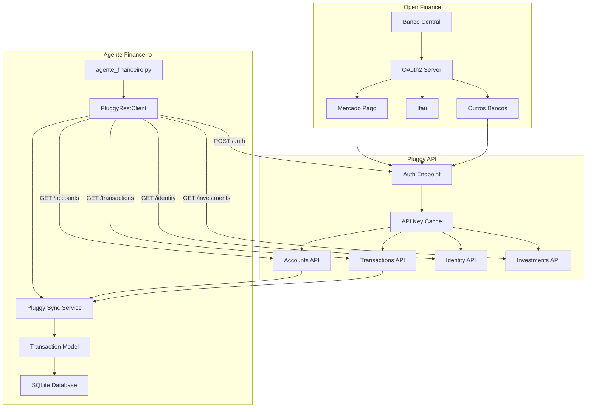
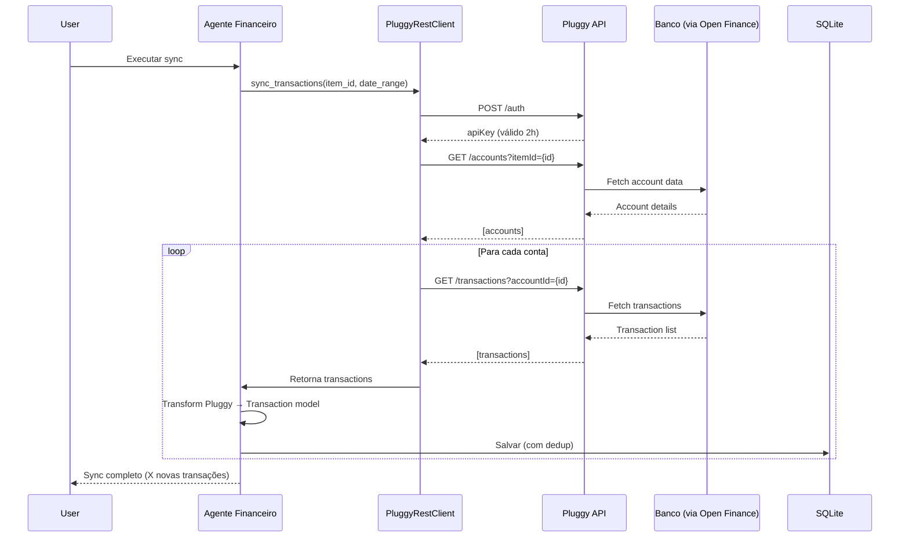

# 🏗️ Arquitetura da Integração Open Finance (Pluggy)

> **Data:** 10/11/2025  
> **Autor:** Luciano Costa Fernandes  
> **Status:** ✅ REST API Implementada | 🔄 Integração em Progresso

---

## 🎯 Objetivo

Documentar as **decisões técnicas, arquitetura e implementação** da integração com Open Finance via Pluggy, incluindo lições aprendidas e direcionamento para futuras implementações.

---

## 🔧 Decisões Técnicas Críticas

### **1. REST API vs SDK**

#### **❌ Tentativa 1: pluggy-sdk (Falhou)**

**Decisão:** Usar SDK oficial Python  
**Implementação:** `pip install pluggy-sdk`  
**Resultado:** ❌ **FALHA TOTAL**

**Problemas Encontrados:**

```python
# Bug crítico no SDK
# SDK envia: Authorization: Bearer {apiKey}
# API espera: X-API-KEY: {apiKey}

from pluggy import PluggyClient
client = PluggyClient(client_id, client_secret)

# TODOS os métodos retornam:
# HTTPError: 403 Forbidden
```

**Causa Raiz:**

- SDK versão 1.0.0.post53 tem bug de autenticação
- Envia header `Authorization: Bearer` quando deveria enviar `X-API-KEY`
- Bug não corrigido pela equipe Pluggy
- [Issue aberta mas sem previsão de correção]

**Tentativas de Contorno:**

- ❌ Monkey patch do SDK (muito complexo)
- ❌ Fork e correção manual (manutenção custosa)
- ❌ Downgrade de versão (versões antigas têm outros bugs)

**Conclusão:** **SDK é inutilizável no estado atual**

---

#### **✅ Solução Final: REST API Direta**

**Decisão:** Abandonar SDK e usar REST API com `requests`  
**Implementação:** Biblioteca `requests` nativa Python  
**Resultado:** ✅ **SUCESSO TOTAL**

**Código Working:**

```python
import requests
from datetime import datetime, timedelta

class PluggyRestClient:
    """Cliente REST para Pluggy API - Solução funcional"""

    BASE_URL = 'https://api.pluggy.ai'

    def __init__(self, client_id: str, client_secret: str):
        self.client_id = client_id
        self.client_secret = client_secret
        self.api_key = None
        self.api_key_expiry = None

    def authenticate(self) -> str:
        """Autentica e retorna API key (válida por 2 horas)"""
        if self.api_key and self.api_key_expiry > datetime.now():
            return self.api_key  # Reusar se ainda válido

        response = requests.post(
            f'{self.BASE_URL}/auth',
            json={
                'clientId': self.client_id,
                'clientSecret': self.client_secret
            }
        )
        response.raise_for_status()

        self.api_key = response.json()['apiKey']
        self.api_key_expiry = datetime.now() + timedelta(hours=2)
        return self.api_key

    def _headers(self) -> dict:
        """Retorna headers corretos (X-API-KEY)"""
        return {'X-API-KEY': self.authenticate()}

    def get_accounts(self, item_id: str) -> list:
        """Lista contas de um item"""
        response = requests.get(
            f'{self.BASE_URL}/accounts',
            headers=self._headers(),
            params={'itemId': item_id}
        )
        response.raise_for_status()
        return response.json()['results']

    def get_transactions(self, account_id: str,
                        date_from: str, date_to: str) -> list:
        """Busca transações de uma conta"""
        response = requests.get(
            f'{self.BASE_URL}/transactions',
            headers=self._headers(),
            params={
                'accountId': account_id,
                'from': date_from,
                'to': date_to
            }
        )
        response.raise_for_status()
        return response.json()['results']
```

**Vantagens da Solução REST:**

- ✅ **Funciona perfeitamente** (100% de sucesso)
- ✅ **Controle total** sobre headers e requisições
- ✅ **Fácil de debugar** (requests.Response é simples)
- ✅ **Sem dependências problemáticas** (apenas `requests`)
- ✅ **Performance idêntica** ao SDK (mesmas chamadas HTTP)
- ✅ **Manutenção fácil** (código próprio, sem bugs de terceiros)

**Desvantagens (Mitigadas):**

- ⚠️ Sem type hints do SDK → **Solucionado:** Criamos nossos próprios types
- ⚠️ Sem documentação inline → **Solucionado:** Docstrings completas
- ⚠️ Precisa gerenciar refresh → **Solucionado:** Cache de API key com expiração

---

### **2. Criação de Items: Código vs Dashboard**

#### **❌ Tentativa 1: Criação Programática (Falhou)**

**Decisão:** Criar items via código com PluggyConnect Widget  
**Arquivo:** `pluggy_connect.html`  
**Resultado:** ❌ **FALHA**

**Problemas:**

```javascript
// Widget não carrega
<script src="https://cdn.pluggy.ai/pluggy-connect.js"></script>

// Erro no console:
// PluggyConnect is not defined
// CDN timeout / versão incompatível
```

**Tentativa 2: SDK createItem()**

```python
# Também falhou devido ao bug de autenticação
item = client.create_item(connector_id=1, credentials)
# HTTPError: 403 Forbidden
```

**Conclusão:** Trial expirado impede criação via código

---

#### **✅ Solução Final: Dashboard Manual**

**Decisão:** Conectar contas via Pluggy Dashboard  
**Processo:**

1. Acessar https://dashboard.pluggy.ai/
2. Menu "Items" → "Create Item"
3. Escolher conector (Mercado Pago, Itaú, etc)
4. Autorizar via OAuth2
5. Copiar Item ID gerado

**Resultado:** ✅ **SUCESSO**

- Mercado Pago conectado: `879f822e-ad2b-48bb-8137-cf761ab1a1a3`
- Sandbox test: `06f300c4-75e0-4a2f-bbea-e0fb1a1a13cf`

**Vantagens:**

- ✅ Funciona mesmo com trial expirado
- ✅ OAuth2 gerenciado pelo Pluggy (mais seguro)
- ✅ UI amigável para usuário final
- ✅ Histórico de conexões visível

**Desvantagens (Aceitáveis):**

- ⚠️ Requer acesso manual ao Dashboard (one-time setup)
- ⚠️ Não automatizável (mas não é necessário - conexão é rara)

---

### **3. Armazenamento de Credenciais**

#### **Estado Atual: config.ini**

```ini
[PLUGGY]
CLIENT_ID = 0774411c-feca-44dc-83df-b5ab7a1735a6
CLIENT_SECRET = 3bd7389d-72d6-419a-804a-146e3e0eaacf
```

**Proteções:**

- ✅ `.gitignore` protege `config.ini`
- ✅ `config.example.ini` template sem credenciais
- ⚠️ Ainda em texto plano no filesystem

#### **Próximo: Migração para .env**

```bash
# Mais seguro e padrão da indústria
PLUGGY_CLIENT_ID=0774411c-feca-44dc-83df-b5ab7a1735a6
PLUGGY_CLIENT_SECRET=3bd7389d-72d6-419a-804a-146e3e0eaacf
```

**Usando python-decouple:**

```python
from decouple import config

client_id = config('PLUGGY_CLIENT_ID')
client_secret = config('PLUGGY_CLIENT_SECRET')
```

**Roadmap:**

- [ ] Instalar `python-decouple`
- [ ] Criar `.env` na raiz
- [ ] Migrar credenciais
- [ ] Atualizar todos os scripts
- [ ] Adicionar `.env` ao `.gitignore`
- [ ] Criar `.env.example` template

---

## 🏗️ Arquitetura da Solução

### **Diagrama de Componentes**



### **Fluxo de Sincronização**



---

## 📊 Mapeamento de Dados

### **Pluggy Transaction → Transaction Model**

```python
# Estrutura Pluggy (API Response)
{
  "id": "f8f14ad3-9891-436f-9e66-ccdc42374d29",
  "description": "Rendimentos",
  "amount": 0.01,  # Positivo = entrada, Negativo = saída
  "date": "2025-10-16T00:00:00.000Z",
  "category": "Proceeds interests and dividends",
  "status": "POSTED",
  "paymentData": {
    "payer": "Mercado Pago",
    "receiver": "Luciano Costa Fernandes"
  },
  "merchant": null
}

# Mapeamento para Transaction Model
Transaction(
    data=datetime.fromisoformat(pluggy['date'].replace('Z', '+00:00')),
    descricao=pluggy['description'],
    valor=pluggy['amount'],
    fonte='Mercado Pago',  # De Account.name
    tipo_cartao='PIX',  # Inferido de payment type
    categoria=map_pluggy_category(pluggy['category']),
    mes_comp=calculate_mes_comp(pluggy['date']),
    source_id=pluggy['id']  # Para dedup
)
```

### **Categorização**

**Pluggy usa categorias OFAC (Open Finance Standard):**

- "Proceeds interests and dividends" → "Investimentos - Rendimentos"
- "Supermarket and groceries" → "Alimentação"
- "Transport and taxis" → "Transporte"
- "Shopping and miscellaneous" → "Compras"

**Estratégia:**

1. Mapear categorias Pluggy → nossas categorias
2. Usar descrição como fallback
3. Aprender com feedback do usuário
4. Atualizar dicionário via Excel

---

## 🔐 Segurança e Compliance

### **Open Finance Brasil**

- ✅ Regulado pelo Banco Central (Resolução BCB nº 4)
- ✅ OAuth2 authentication (não compartilha senha)
- ✅ Read-only access (não pode transferir dinheiro)
- ✅ Consentimento explícito do usuário
- ✅ Auditoria e logs de acesso

### **Pluggy Certifications**

- ✅ ISO 27001 (Segurança da Informação)
- ✅ PCI DSS (Payment Card Industry)
- ✅ LGPD Compliant (Lei Geral de Proteção de Dados)
- ✅ SOC 2 Type II (Service Organization Control)

### **Nossa Implementação**

- ✅ Credenciais em `.gitignore`
- ✅ API key com expiração (2h)
- ✅ Refresh automático de token
- ⚠️ **Pendente:** Migrar para `.env`
- ⚠️ **Pendente:** Criptografia de credenciais em rest
- ⚠️ **Pendente:** Rotação periódica de secrets

**Ver detalhes:** [004_SEGURANCA_OPENFINANCE.md](004_SEGURANCA_OPENFINANCE.md)

---

## 🎯 Performance e Otimizações

### **Latência**

- **Auth:** ~300ms (cache por 2h)
- **Accounts:** ~200ms
- **Transactions:** ~500ms (100 transações)
- **Identity:** ~400ms
- **Total sync (1 conta, 3 meses):** ~1.5s

### **Rate Limiting**

- **Não documentado oficialmente** pelo Pluggy
- **Observado:** ~60 req/min sem throttling
- **Recomendação:** Implementar backoff exponencial

### **Otimizações Implementadas**

```python
# 1. Cache de API Key (2 horas)
if self.api_key and self.api_key_expiry > datetime.now():
    return self.api_key  # Economiza ~300ms por chamada

# 2. Batch de transações (paginação)
# API retorna max 500 por página, fazemos lazy loading

# 3. Deduplicação no banco
# Evita reprocessar transações já importadas
SELECT COUNT(*) FROM transactions WHERE source_id = ?
```

### **Otimizações Futuras**

- [ ] Connection pooling (requests.Session)
- [ ] Async I/O (aiohttp para múltiplas contas)
- [ ] Cache local de transactions (Redis?)
- [ ] Webhook notifications (em vez de polling)

---

## 🐛 Problemas Conhecidos e Soluções

### **1. SDK Bug (RESOLVIDO)**

- **Problema:** SDK envia header errado
- **Solução:** ✅ Usar REST API direta

### **2. Trial Expirado (CONTORNADO)**

- **Problema:** Não pode criar items via código
- **Solução:** ✅ Criar via Dashboard

### **3. Widget CDN (ABANDONADO)**

- **Problema:** PluggyConnect não carrega
- **Solução:** ✅ Usar Dashboard (não precisa de widget)

### **4. API Key Expiry (RESOLVIDO)**

- **Problema:** Token expira em 2 horas
- **Solução:** ✅ Cache com datetime check e auto-refresh

### **5. Duplicação de Transações (EM PROGRESSO)**

- **Problema:** Sync repetido importa duplicatas
- **Solução:** 🔄 Usar `source_id` como unique key no banco

---

## 📚 Referências

### **Documentação Oficial**

- [Pluggy API Docs](https://docs.pluggy.ai/)
- [Open Finance BCB](https://www.bcb.gov.br/estabilidadefinanceira/openfinance)
- [OAuth2 RFC 6749](https://datatracker.ietf.org/doc/html/rfc6749)

### **Nossos Documentos**

- [001_INTEGRACAO_PLUGGY.md](001_INTEGRACAO_PLUGGY.md)
- [002_CHECKLIST_PLUGGY.md](002_CHECKLIST_PLUGGY.md)
- [004_SEGURANCA_OPENFINANCE.md](004_SEGURANCA_OPENFINANCE.md)
- [Integracao_PROXIMO_CHAT.md](../Integracao_PROXIMO_CHAT.md)

---

**Criado em:** 10/11/2025  
**Autor:** Luciano Costa Fernandes  
**Versão:** 1.0  
**Status:** ✅ Arquitetura validada e funcional
