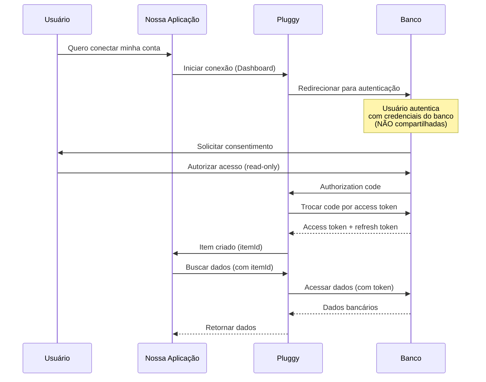

# 🔐 Segurança Open Finance - Pluggy

> **Data:** 10/11/2025  
> **Autor:** Luciano Costa Fernandes  
> **Status:** ✅ Produção | 🔄 Melhorias Planejadas

---

## 🎯 Objetivo

Documentar os aspectos de **segurança, privacidade e compliance** da integração Open Finance via Pluggy, garantindo conformidade com LGPD, BCB e melhores práticas da indústria.

---

## 🏛️ Regulamentação Open Finance Brasil

### **Banco Central do Brasil (BCB)**

O Open Finance (antigo Open Banking) é **regulado pelo Banco Central** através da:

- **Resolução BCB nº 4.658/2018** - Regulamentação inicial
- **Resolução Conjunta nº 1/2020** - Open Banking (fase 1)
- **Resolução BCB nº 32/2020** - Compartilhamento de dados
- **Circular BCB nº 4.015/2020** - Segurança cibernética

**Principais Pontos:**

- ✅ **Consentimento explícito** do titular dos dados
- ✅ **Finalidade específica** para coleta de dados
- ✅ **Prazo determinado** para acesso (máx 12 meses, renovável)
- ✅ **Revogação a qualquer momento** pelo usuário
- ✅ **Auditoria e rastreabilidade** de todos os acessos
- ✅ **Segurança da informação** (criptografia, controle de acesso)

### **Certificação Obrigatória**

Instituições participantes devem:

- ✅ Certificado digital ICP-Brasil
- ✅ Certificação ISO 27001 (Segurança da Informação)
- ✅ Testes de penetração periódicos
- ✅ Plano de resposta a incidentes
- ✅ Notificação ao BCB em caso de vazamento

**Status Pluggy:**

- ✅ Certificada pelo Banco Central como Agregadora
- ✅ ISO 27001:2013 (renovada anualmente)
- ✅ PCI DSS Level 1 (cartões de pagamento)
- ✅ SOC 2 Type II (controles internos)

---

## 🔒 Modelo de Segurança OAuth2

### **Fluxo de Autorização**



### **Pontos de Segurança**

1. **Senha NUNCA é compartilhada**

   - ❌ Nossa aplicação NÃO tem acesso à senha do banco
   - ❌ Pluggy NÃO tem acesso à senha do banco
   - ✅ Usuário autentica diretamente no site do banco

2. **Access Token Temporário**

   - ✅ Token expira após período determinado
   - ✅ Refresh token permite renovação
   - ✅ Revogação a qualquer momento pelo usuário

3. **Escopo Limitado (Read-Only)**
   - ✅ **APENAS LEITURA** de dados
   - ❌ **NÃO PODE** transferir dinheiro
   - ❌ **NÃO PODE** modificar cadastro
   - ❌ **NÃO PODE** criar boletos/PIX

---

## 🛡️ Segurança da Nossa Aplicação

### **Armazenamento de Credenciais**

#### **Estado Atual**

```
config/
├── config.ini          # ❌ NÃO versionado (.gitignore)
└── config.example.ini  # ✅ Template público (sem secrets)
```

**Conteúdo de config.ini:**

```ini
[PLUGGY]
CLIENT_ID = 0774411c-feca-44dc-83df-b5ab7a1735a6      # API Key
CLIENT_SECRET = 3bd7389d-72d6-419a-804a-146e3e0eaacf  # Secret
```

**Proteções Atuais:**

- ✅ `.gitignore` protege contra commit acidental
- ✅ Permissões de arquivo (chmod 600 em Linux)
- ⚠️ Texto plano no filesystem (risco local)

#### **Melhorias Planejadas**

**1. Migração para .env**

```bash
# .env (raiz do projeto)
PLUGGY_CLIENT_ID=0774411c-feca-44dc-83df-b5ab7a1735a6
PLUGGY_CLIENT_SECRET=3bd7389d-72d6-419a-804a-146e3e0eaacf
```

**2. Uso de python-decouple**

```python
from decouple import config

client_id = config('PLUGGY_CLIENT_ID')
client_secret = config('PLUGGY_CLIENT_SECRET')
```

**3. Criptografia em Repouso (Futuro)**

```python
from cryptography.fernet import Fernet

# Gerar chave (uma vez, guardar em local seguro)
key = Fernet.generate_key()

# Criptografar secret antes de salvar
cipher = Fernet(key)
encrypted_secret = cipher.encrypt(client_secret.encode())

# Descriptografar ao usar
decrypted_secret = cipher.decrypt(encrypted_secret).decode()
```

---

### **Segurança de API Keys**

#### **Ciclo de Vida do API Key**

```python
# 1. Autenticação (POST /auth)
response = requests.post('https://api.pluggy.ai/auth', json={
    'clientId': CLIENT_ID,
    'clientSecret': CLIENT_SECRET
})

api_key = response.json()['apiKey']  # Válido por 2 horas

# 2. Cache em memória (não persiste)
self.api_key = api_key
self.api_key_expiry = datetime.now() + timedelta(hours=2)

# 3. Refresh automático antes de expirar
if datetime.now() >= self.api_key_expiry - timedelta(minutes=5):
    self.authenticate()  # Renova

# 4. Uso em requisições
headers = {'X-API-KEY': self.api_key}
```

**Boas Práticas Implementadas:**

- ✅ API key **nunca** é salva em arquivo
- ✅ Armazenada apenas em **memória** (variável de instância)
- ✅ **Expira automaticamente** após 2 horas
- ✅ **Refresh automático** antes da expiração
- ✅ **Uma API key por sessão** (não compartilhada)

#### **Rotação de Secrets**

**Processo Recomendado (a implementar):**

1. Gerar novo CLIENT_SECRET no Dashboard Pluggy
2. Atualizar `.env` com novo secret
3. Testar conexão
4. Revogar secret antigo no Dashboard
5. **Frequência:** A cada 90 dias (mínimo)

---

## 🔍 Auditoria e Logs

### **O que Logamos**

```python
import logging

logger = logging.getLogger('pluggy_integration')

# Eventos logados:
logger.info('Autenticação bem-sucedida')
logger.info(f'Buscando transações: account={account_id}, from={date_from}')
logger.info(f'Recuperadas {len(transactions)} transações')

# Erros logados:
logger.error(f'Falha na autenticação: {error}')
logger.error(f'API error: {response.status_code} - {response.text}')
```

**❌ O que NÃO logamos (segurança):**

- ❌ CLIENT_SECRET
- ❌ API Keys
- ❌ Senhas de banco
- ❌ Números de conta completos (mascaramos)
- ❌ CPF completo (mascaramos: **_._**.986-53)

### **Logs de Acesso Pluggy**

Pluggy mantém logs de auditoria:

- ✅ Data/hora de cada acesso
- ✅ IP de origem
- ✅ Endpoints acessados
- ✅ Item/Account consultado
- ✅ Sucesso/falha da requisição

**Acesso aos logs:**

- Dashboard Pluggy → "Activity Logs"
- Retenção: 90 dias

---

## 🔐 LGPD Compliance

### **Lei Geral de Proteção de Dados**

#### **Dados Pessoais Coletados**

| Dado                   | Finalidade               | Base Legal    | Retenção      |
| ---------------------- | ------------------------ | ------------- | ------------- |
| **Nome completo**      | Identificação do titular | Consentimento | Até revogação |
| **CPF**                | Identificação fiscal     | Consentimento | Até revogação |
| **Data de nascimento** | Validação de identidade  | Consentimento | Até revogação |
| **Endereço**           | Informação cadastral     | Consentimento | Até revogação |
| **Email**              | Contato                  | Consentimento | Até revogação |
| **Telefone**           | Contato                  | Consentimento | Até revogação |
| **Transações**         | Categorização financeira | Consentimento | Até revogação |
| **Saldo**              | Análise financeira       | Consentimento | Até revogação |

#### **Direitos do Titular (Art. 18 LGPD)**

✅ **Confirmação de existência de tratamento** - Usuário pode verificar no Dashboard  
✅ **Acesso aos dados** - Exportação via Excel/JSON  
✅ **Correção de dados** - Atualização via Dashboard do banco  
✅ **Anonimização/bloqueio** - Não aplicável (só leitura)  
✅ **Eliminação** - Deletar item no Pluggy Dashboard  
✅ **Portabilidade** - Exportação em formato estruturado  
✅ **Revogação de consentimento** - Revogar no banco ou Pluggy  
✅ **Informação sobre compartilhamento** - Documentado neste arquivo

#### **Compartilhamento de Dados**

```
Titular (Você)
    ↓
Banco (Ex: Mercado Pago, Itaú)
    ↓ [Via Open Finance BCB]
Pluggy (Agregadora Certificada)
    ↓ [Via API]
Nossa Aplicação (Agente Financeiro)
    ↓
SQLite Local (Não compartilhado)
```

**Terceiros com acesso:**

- ✅ **Pluggy:** Agregadora certificada pelo BCB
- ❌ **Nenhum outro:** Dados ficam apenas local

#### **Implementação LGPD**

**Políticas Necessárias (a criar):**

- [ ] Termo de Consentimento
- [ ] Política de Privacidade
- [ ] Procedimento de Revogação
- [ ] Processo de Exclusão de Dados
- [ ] Notificação de Incidentes

**Código para Exclusão (exemplo):**

```python
def excluir_dados_usuario(item_id: str):
    """
    Exclui todos os dados de um usuário (LGPD Art. 18)
    """
    # 1. Deletar transações locais
    db.execute(
        "DELETE FROM transactions WHERE source LIKE ?",
        (f'%{item_id}%',)
    )

    # 2. Deletar item no Pluggy (revoga acesso)
    requests.delete(
        f'https://api.pluggy.ai/items/{item_id}',
        headers={'X-API-KEY': api_key}
    )

    # 3. Logar exclusão (auditoria)
    logger.info(f'Dados do item {item_id} excluídos (LGPD)')
```

---

## 🚨 Plano de Resposta a Incidentes

### **Cenários de Risco**

#### **1. Vazamento de CLIENT_SECRET**

**Impacto:** Atacante pode acessar dados via API  
**Probabilidade:** Baixa (protegido por .gitignore)

**Resposta:**

1. **Imediato:** Revogar CLIENT_SECRET no Dashboard Pluggy
2. **Urgente:** Gerar novo CLIENT_SECRET
3. **Urgente:** Atualizar `.env` local
4. **24h:** Notificar usuários afetados
5. **48h:** Analisar logs de acesso para detectar abusos
6. **72h:** Relatório de incidente (interno)

#### **2. Acesso não autorizado ao banco de dados local**

**Impacto:** Exposição de transações financeiras  
**Probabilidade:** Baixa (arquivo local)

**Resposta:**

1. **Imediato:** Trocar senha do computador
2. **Urgente:** Criptografar banco de dados
3. **24h:** Revisar quem teve acesso físico/remoto
4. **48h:** Notificar titulares dos dados (LGPD)
5. **72h:** Implementar criptografia em repouso

#### **3. Comprometimento de Conta Pluggy**

**Impacto:** Atacante pode criar/deletar items  
**Probabilidade:** Baixa (2FA habilitado)

**Resposta:**

1. **Imediato:** Trocar senha do Pluggy Dashboard
2. **Imediato:** Habilitar 2FA (se não estiver)
3. **Urgente:** Revogar todos os CLIENT_SECRETS
4. **Urgente:** Revisar items conectados
5. **24h:** Verificar logs de atividade
6. **48h:** Notificar suporte Pluggy

---

## 📊 Comparação com Alternativas

| Método                    | Segurança  | Legalidade     | Manutenção | Nossa Escolha    |
| ------------------------- | ---------- | -------------- | ---------- | ---------------- |
| **Open Finance (Pluggy)** | ⭐⭐⭐⭐⭐ | ✅ Legal (BCB) | ⭐⭐⭐⭐   | ✅ **ESCOLHIDO** |
| **Web Scraping**          | ⭐⭐       | ❌ Viola ToS   | ⭐         | ❌               |
| **Manual (Excel)**        | ⭐⭐⭐⭐⭐ | ✅ Legal       | ⭐⭐       | ✅ Backup        |
| **Banco direto (API)**    | ⭐⭐⭐⭐⭐ | ✅ Legal       | ⭐         | ❌ Não tem API   |

**Por que Open Finance é mais seguro que Scraping:**

| Aspecto        | Scraping                   | Open Finance               |
| -------------- | -------------------------- | -------------------------- |
| **Senha**      | ⚠️ Você compartilha        | ✅ OAuth (não compartilha) |
| **Acesso**     | ⚠️ Full access             | ✅ Read-only               |
| **Revogação**  | ❌ Trocar senha            | ✅ Revoga token            |
| **ToS**        | ❌ Viola termos            | ✅ Autorizado pelo banco   |
| **Manutenção** | ❌ Quebra com mudanças     | ✅ API estável             |
| **Auditoria**  | ❌ Sem logs                | ✅ Logs completos          |
| **Legal**      | ❌ Juridicamente arriscado | ✅ Regulado pelo BCB       |

---

## ✅ Checklist de Segurança

### **Implementado**

- [x] Credenciais em `.gitignore`
- [x] Template `config.example.ini` sem secrets
- [x] API key com expiração (2h)
- [x] Refresh automático de token
- [x] Logs de auditoria (sem secrets)
- [x] OAuth2 (não compartilha senha)
- [x] Read-only access

### **Pendente (Alta Prioridade)**

- [ ] Migrar para `.env` + `python-decouple`
- [ ] Implementar rotação de secrets (90 dias)
- [ ] Criar Termo de Consentimento (LGPD)
- [ ] Criar Política de Privacidade
- [ ] Procedimento de exclusão de dados

### **Pendente (Média Prioridade)**

- [ ] Criptografia de banco SQLite em repouso
- [ ] 2FA no Dashboard Pluggy
- [ ] Alertas de atividade suspeita
- [ ] Backup criptografado

### **Pendente (Baixa Prioridade)**

- [ ] Penetration testing
- [ ] Certificação ISO 27001 (se escalar)
- [ ] Seguro cibernético

---

## 📞 Contatos de Segurança

### **Reportar Vulnerabilidade**

**Nossa aplicação:**

- **Email:** luti_vix@hotmail.com
- **GitHub Issues:** Marcar como [SECURITY]

**Pluggy:**

- **Email:** security@pluggy.ai
- **Bug Bounty:** https://pluggy.ai/security

**Banco Central:**

- **Email:** secif@bcb.gov.br (Segurança Cibernética)
- **Telefone:** 0800 979 2345

---

## 📚 Referências

### **Regulamentação**

- [Resolução BCB nº 4.658/2018](https://www.bcb.gov.br/estabilidadefinanceira/exibenormativo?tipo=Resolu%C3%A7%C3%A3o&numero=4658)
- [LGPD - Lei 13.709/2018](http://www.planalto.gov.br/ccivil_03/_ato2015-2018/2018/lei/l13709.htm)
- [Open Finance Brasil](https://openfinancebrasil.org.br/)

### **Padrões de Segurança**

- [OWASP Top 10](https://owasp.org/www-project-top-ten/)
- [OAuth 2.0 Security Best Practices](https://datatracker.ietf.org/doc/html/draft-ietf-oauth-security-topics)
- [ISO 27001](https://www.iso.org/isoiec-27001-information-security.html)

### **Nossos Documentos**

- [001_INTEGRACAO_PLUGGY.md](001_INTEGRACAO_PLUGGY.md)
- [003_ARQUITETURA_PLUGGY.md](003_ARQUITETURA_PLUGGY.md)
- [Integracao_PROXIMO_CHAT.md](../Integracao_PROXIMO_CHAT.md)

---

**Criado em:** 10/11/2025  
**Autor:** Luciano Costa Fernandes  
**Versão:** 1.0  
**Classificação:** 🔒 Confidencial  
**Revisão:** Anual ou após incidentes
