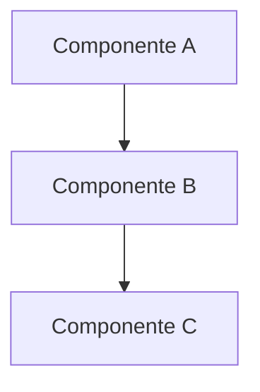

# 📚 Guia de Organização de Projetos - Padrão de Documentação

> **📌 Documento Reutilizável**  
> Use este guia como template para organizar a documentação de qualquer projeto de software.

---

## 🎯 Objetivo

Este guia apresenta um **padrão de organização de documentação** que pode ser aplicado a qualquer projeto, promovendo:

- ✅ **Clareza** - Estrutura lógica e fácil de navegar
- ✅ **Rastreabilidade** - Numeração cronológica e histórico de mudanças
- ✅ **Manutenibilidade** - Convenções consistentes
- ✅ **Escalabilidade** - Cresce de forma organizada
- ✅ **Colaboração** - Facilita onboarding de novos membros

---

## 📂 Estrutura Base Recomendada

```
/
├── README.md                    # Apresentação do projeto
├── CONTRIBUTING.md              # Guia de contribuição e commits
├── CHANGELOG.md                 # Histórico de versões (semântico)
├── LICENSE                      # Licença do projeto
├── .gitignore                   # Arquivos ignorados pelo git
│
├── /src/                        # Código-fonte
├── /tests/                      # Testes automatizados
├── /scripts/                    # Scripts de automação
│   ├── /testes/                 # Scripts de teste
│   └── /utils/                  # Scripts utilitários
│
├── /dados/                      # Dados e migrações
│   ├── /migrations/             # Migrações de banco de dados
│   ├── /planilhas/              # Planilhas e CSVs
│   ├── /work/                   # Scripts temporários de trabalho
│   └── /Backups/                # Backups
│
└── /docs/                       # Documentação
    ├── README.md                # Índice da documentação
    ├── Andamento.md             # Histórico de reuniões/decisões
    ├── Docs_PROXIMO_CHAT.md    # Contexto rápido para IA/novos membros
    │
    ├── /chamados/               # Chamados/tickets de clientes (se aplicável)
    │   ├── README.md            # Índice de chamados
    │   ├── /CXXXX/              # Chamado específico
    │   └── /CYYYY/              # Outro chamado
    ├── /documentation/          # Guias e padrões de documentação
    ├── /Desenvolvimento/        # Arquitetura e configuração
    ├── /API/                    # Documentação de APIs
    ├── /Treinamento/            # Material de treinamento
    ├── /[Feature]/              # Por feature/módulo do sistema
    └── /_snapshots/             # Backups da documentação
```

---

## 📝 Convenções de Nomenclatura

### **1. Arquivos de Documentação**

#### **Padrão:** `XXX_NOME_DESCRITIVO.md`

- **XXX** = Número cronológico (001, 002, 003...)
- **NOME_DESCRITIVO** = Título em SNAKE_CASE
- **Exceções:**
  - `README.md` (sempre sem número)
  - `CHANGELOG.md` (sempre sem número)
  - `CONTRIBUTING.md` (sempre sem número)

#### **Exemplos:**

```
✅ 001_ESTRUTURA_PROJETO.md
✅ 002_GUIA_INSTALACAO.md
✅ 003_ARQUITETURA_BACKEND.md
✅ README.md
❌ estrutura-projeto.md
❌ 1_estrutura.md
❌ estrutura_projeto.md (sem número)
```

### **2. Pastas de Documentação**

#### **Padrão:** `PascalCase` ou `kebab-case`

```
✅ /Desenvolvimento/
✅ /API/
✅ /feature-name/
❌ /desenvolvimento/  (minúsculo)
❌ /dev_folder/       (snake_case)
```

### **3. Migrações de Banco de Dados**

#### **Padrão:** `CXXX_YY_Descricao.sql`

- **CXXX** = Série de migração (C001, C002, C003...)
- **YY** = Ordem dentro da série (00, 01, 02...)
- **Descricao** = Nome descritivo

#### **Exemplos:**

```
✅ C002_00_Migrations_ORM.sql
✅ C002_01_Add_Users_Table.sql
✅ Migration_Add_RomaneioSequencia.sql
✅ Ajuste_UpdateStock_Indevido.sql
```

### **4. Scripts de Trabalho**

#### **Padrão:** `Modulo_Work.sql` ou `Script_Teste.sql`

```
✅ Produto_Estoque_Work.sql
✅ Romaneio_Work.sql
✅ Script_Analise_Performance.sql
```

### **5. Chamados/Tickets de Cliente**

#### **Padrão:** `CXXXX` (pasta) e arquivos com prefixos específicos

- **Pasta:** `CXXXX` onde X = número sequencial de 4 dígitos
- **Escopo:** `EC_[Empresa]_YYYYMMDD_CXXXX_TituloChamado_vXX.[md|pdf|xlsx]`
- **Testes:** `PT_[Empresa]_YYYYMMDD_CXXXX_TituloChamado_vXX.[md|pdf|xlsx]`
- **Docs:** `CXXXX_Descricao_Especifica.md`

#### **Exemplos:**

```
✅ /chamados/C1566/
✅ /chamados/C1573/
✅ EC_LF_20251113_C1573_OtimizacaoTermometros_v00.md
✅ PT_LF_20251113_C1573_OtimizacaoTermometros_v00.md
✅ C1573_Modal_Detalhes_Termometros.md
```

#### **Estrutura de Pasta de Chamado:**

```
/CXXXX/
├── README.md                           # Resumo executivo
├── EC_*.md                             # Escopo do Chamado
├── PT_*.md                             # Plano de Testes
├── *.sql                               # Scripts necessários
├── *.html                              # Mockups/protótipos
└── /assets/                            # Imagens e anexos
```

---

## 📋 Templates de Documentação

### **Template: Arquivo de Feature/Módulo**

````markdown
# [Título Descritivo da Feature]

> **Data:** DD/MM/YYYY  
> **Autor:** Nome do Desenvolvedor  
> **Branch:** nome-da-branch  
> **Status:** [Em Desenvolvimento / Concluído / Deprecated]

---

## 🎯 Objetivo

Breve descrição do que esta documentação cobre e seu propósito.

---

## 📋 Contexto

- **Motivação:** Por que esta mudança foi necessária?
- **Problema:** Qual problema estamos resolvendo?
- **Impacto:** Quem é afetado por esta mudança?

---

## 🔧 Implementação

### Arquitetura


````

### Arquivos Modificados

- `src/module/file1.ts` - Descrição
- `src/module/file2.ts` - Descrição

### Código Relevante

```typescript
// Exemplo de código importante
export function exemplo() {
  // ...
}
```

---

## ✅ Resultados

- [ ] Funcionalidade X implementada
- [ ] Testes adicionados
- [ ] Documentação atualizada

---

## 🧪 Como Testar

```bash
# Passos para reproduzir/testar
npm run test
```

---

## 📚 Referências

- [Link para Issue/PR](#)
- [Documentação Externa](https://example.com)
- `/docs/OutroDocumento.md`

---

**Última atualização:** DD/MM/YYYY

````

---

### **Template: README.md de Pasta**

```markdown
# 📁 [Nome da Pasta]

Breve descrição do conteúdo desta pasta.

## 📂 Estrutura

````

/NomePasta/
├── 001_PRIMEIRO_DOC.md
├── 002_SEGUNDO_DOC.md
└── README.md

```

## 📝 Documentos

| Arquivo | Descrição |
|---------|-----------|
| `001_PRIMEIRO_DOC.md` | Descrição breve |
| `002_SEGUNDO_DOC.md` | Descrição breve |

## 🔗 Links Relacionados

- `/docs/OutraPasta/`
- `/src/modulo/`
```

---

### **Template: CHANGELOG.md**

```markdown
# Changelog

Todas as mudanças notáveis deste projeto serão documentadas neste arquivo.

O formato é baseado em [Keep a Changelog](https://keepachangelog.com/pt-BR/1.0.0/),
e este projeto adere ao [Versionamento Semântico](https://semver.org/lang/pt-BR/).

---

## [Unreleased]

### Added

- Novas funcionalidades não lançadas

### Changed

- Mudanças em funcionalidades existentes

### Fixed

- Correções de bugs

---

## [1.2.0] - 2025-11-07

### Added

- Feature X implementada (#123)
- Endpoint Y adicionado à API

### Changed

- Refatoração do módulo Z
- Atualização de dependências

### Fixed

- Correção de bug no componente W (#456)

### Security

- Corrigidas 10 vulnerabilidades (npm audit fix)

---

## [1.1.0] - 2025-10-15

### Added

- Integração com serviço externo

---

## [1.0.0] - 2025-09-01

### Added

- Release inicial do projeto
```

---

### **Template: README.md de Chamados**

```markdown
# 📞 Chamados [Nome do Projeto]

Documentação de todos os chamados/tickets de atendimento ao cliente.

## 📋 Sobre os Chamados

Os chamados representam solicitações de:
- 🐛 Correção de bugs
- ✨ Novas funcionalidades
- 🔍 Análises técnicas
- 🔧 Melhorias e otimizações

## 📂 Estrutura de um Chamado

```
/CXXXX/
├── README.md                    # Resumo executivo
├── EC_*.md                      # Escopo do Chamado
├── PT_*.md                      # Plano de Testes
└── /assets/                     # Recursos
```

## 📋 Índice de Chamados

| Código | Título | Tipo | Status | Data |
|--------|--------|------|--------|------|
| [C0001](C0001/) | Título | 🐛 Bug | ✅ | DD/MM/YYYY |
| [C0002](C0002/) | Título | ✨ Feature | 🚧 | DD/MM/YYYY |

## 🔄 Workflow de Chamado

1. Cliente abre chamado
2. Análise técnica
3. Criar pasta CXXXX
4. Documentar escopo (EC)
5. Desenvolvimento
6. Criar plano de testes (PT)
7. Homologação
8. Deploy e fechamento
```

---

### **Template: CONTRIBUTING.md**

```markdown
# 🤝 Guia de Contribuição

Obrigado por contribuir com este projeto! Siga as diretrizes abaixo.

---

## 📋 Padrão de Commits

### Formato
```

<tipo>(<escopo>): <descrição>

[corpo opcional]

[rodapé opcional]

````

### Tipos Permitidos

- **feat**: Nova funcionalidade
- **fix**: Correção de bug
- **docs**: Mudanças na documentação
- **style**: Formatação, ponto e vírgula, etc
- **refactor**: Refatoração de código
- **test**: Adição/correção de testes
- **chore**: Tarefas de manutenção

### Exemplos

```bash
feat(auth): adiciona autenticação JWT

fix(api): corrige erro 500 no endpoint /users

docs(readme): atualiza instruções de instalação

refactor(database): migra de TypeORM para Prisma
````

---

## 🔄 Workflow Git

1. **Clone o repositório**

   ```bash
   git clone https://github.com/usuario/projeto.git
   ```

2. **Crie uma branch**

   ```bash
   git checkout -b feature/nome-da-feature
   ```

3. **Faça commits atômicos**

   ```bash
   git add .
   git commit -m "feat(module): descrição"
   ```

4. **Push para o repositório**

   ```bash
   git push origin feature/nome-da-feature
   ```

5. **Abra um Pull Request**

---

## ✅ Checklist antes de PR

- [ ] Código segue o style guide do projeto
- [ ] Testes adicionados/atualizados
- [ ] Documentação atualizada
- [ ] Commit messages seguem o padrão
- [ ] Build está passando sem erros

---

## 📚 Recursos

- [Conventional Commits](https://www.conventionalcommits.org/)
- [Keep a Changelog](https://keepachangelog.com/)

```

---

## 🗂️ Categorização de Documentação

### **Por Tipo de Projeto**

#### **Projeto Backend/API**
```

/docs/
├── README.md                    # Índice principal
├── /API/                        # Endpoints, schemas, collections
├── /Arquitetura/                # Design patterns, diagramas
├── /Database/                   # Migrações, schemas
├── /Deploy/                     # Docker, CI/CD, servidor
└── /Seguranca/                  # Auth, permissões, vulnerabilidades

```

#### **Projeto Frontend**
```

/docs/
├── README.md                    # Índice principal
├── /Componentes/                # Documentação de componentes
├── /Layout/                     # Design system, estilos
├── /Rotas/                      # Estrutura de navegação
├── /Estado/                     # Redux, Context API
└── /Mobile/                     # Responsividade, PWA

```

#### **Projeto Fullstack**
```

/docs/
├── README.md                    # Índice principal
├── /Desenvolvimento/            # Setup, arquitetura geral
├── /Backend/                    # Docs específicas do backend
├── /Frontend/                   # Docs específicas do frontend
├── /API/                        # Contratos de API
├── /Deploy/                     # Infraestrutura, CI/CD
└── /Treinamento/                # Onboarding, tutoriais

```

#### **Projeto com Atendimento ao Cliente** ⭐ Novo

```
/docs/
├── README.md                    # Índice principal da documentação
├── /chamados/                   # Chamados/tickets de clientes
│   ├── README.md                # Índice de chamados
│   ├── /C0001/                  # Chamado específico
│   │   ├── README.md            # Resumo executivo
│   │   ├── EC_*.md              # Escopo
│   │   ├── PT_*.md              # Plano de Testes
│   │   └── /assets/             # Recursos
│   └── /C0002/                  # Outro chamado
├── /documentation/              # Guias e padrões
├── /Desenvolvimento/            # Arquitetura e configuração
└── /API/                        # Documentação de APIs
```

**Características:**
- ✅ Rastreamento completo de chamados
- ✅ Histórico de atendimento
- ✅ Documentação por chamado
- ✅ Métricas de atendimento
- ✅ Templates padronizados

**Quando usar:**
- Projetos com múltiplos clientes
- Suporte e manutenção contínua
- SaaS com tickets de suporte
- Consultorias com demandas pontuais

````

---

## 🎨 Boas Práticas de Markdown

### **1. Use Emojis para Seções**

```markdown
## 🎯 Objetivo
## 📋 Contexto
## 🔧 Implementação
## ✅ Resultados
## 📚 Referências
````

### **2. Destaque Informações Importantes**

```markdown
> **⚠️ Atenção:** Informação crítica

> **💡 Dica:** Dica útil

> **📌 Nota:** Observação importante
```

### **3. Use Blocos de Código com Linguagem**

````markdown
\```typescript
const exemplo: string = "código";
\```

\```bash
npm install
\```
````

### **4. Crie Tabelas para Comparações**

```markdown
| Feature | Backend | Frontend |
| ------- | ------- | -------- |
| Auth    | ✅      | ✅       |
| Tests   | ⚠️      | ❌       |
```

### **5. Diagramas Mermaid**

````markdown
\```mermaid
graph LR
A[Cliente] --> B[API]
B --> C[Database]
\```
````

---

## 🔄 Processo de Reorganização

### **Passo 1: Auditoria**

1. Liste todos os documentos atuais
2. Identifique duplicações
3. Mapeie categorias naturais
4. Verifique arquivos obsoletos

### **Passo 2: Planejamento**

1. Defina estrutura de pastas
2. Crie convenção de nomenclatura
3. Estabeleça regras de versionamento
4. Planeje migração de arquivos

### **Passo 3: Execução**

```bash
# Criar estrutura de pastas
mkdir -p docs/{Desenvolvimento,API,Deploy,Features}

# Mover arquivos
mv old-doc.md docs/Features/001_OLD_DOC.md

# Renumerar cronologicamente
# (verificar datas de criação)
```

### **Passo 4: Atualização**

1. Criar READMEs em cada pasta
2. Atualizar links internos
3. Criar `Docs_PROXIMO_CHAT.md`
4. Atualizar CHANGELOG.md

### **Passo 5: Validação**

- [ ] Todos os links funcionam?
- [ ] Numeração está correta?
- [ ] READMEs estão completos?
- [ ] Nenhum arquivo ficou para trás?

---

## 🛠️ Ferramentas Úteis

### **Scripts de Automação**

#### **Renumerar Arquivos**

```bash
#!/bin/bash
# renumber-docs.sh

cd docs/Feature
counter=1
for file in $(ls -t *.md | grep -v README); do
  newname=$(printf "%03d_%s" $counter "${file#*_}")
  if [ "$file" != "$newname" ]; then
    mv "$file" "$newname"
  fi
  ((counter++))
done
```

#### **Gerar Índice Automático**

```bash
#!/bin/bash
# generate-index.sh

echo "# 📚 Documentação" > README.md
echo "" >> README.md

for dir in */; do
  echo "## ${dir%/}" >> README.md
  ls "$dir"*.md 2>/dev/null | while read file; do
    echo "- [$file]($file)" >> README.md
  done
  echo "" >> README.md
done
```

### **Extensões VS Code Recomendadas**

- **Markdown All in One** - Atalhos e preview
- **Markdown Preview Mermaid** - Diagramas Mermaid
- **markdownlint** - Linter para Markdown
- **GitHub Markdown Preview** - Preview estilo GitHub

---

## 📊 Exemplos Práticos

### **Exemplo 1: Projeto BelgoEstoque (Interno)**

#### **Antes da Reorganização**

```
/docs/
├── ajuste-dashboard.md
├── romaneio-omie.md
├── deploy.txt
├── mobile-app.md
└── server-config.md
```

❌ Sem categorização  
❌ Sem numeração  
❌ Formatos mistos (.md e .txt)  
❌ Nomes genéricos

#### **Depois da Reorganização**

```
/docs/
├── README.md
├── Docs_PROXIMO_CHAT.md
│
├── /Dashboard/
│   └── 001_AJUSTE_NOMES_LOJAS.md
│
├── /RomaneioOmie/
│   ├── 001_ROMANEIO_RESERVA_OMIE.md
│   └── 002_TROUBLESHOOTING.md
│
├── /Servidor/
│   ├── 001_QUICK_START.md
│   └── 002_DEPLOY_DOCKER.md
│
└── /Mobile/
    └── 001_GUIA_IMPLEMENTACAO.md
```

✅ Categorização clara  
✅ Numeração cronológica  
✅ Formato padronizado (.md)  
✅ Nomes descritivos

---

### **Exemplo 2: Projeto ACTWEB (Cliente VLI)** ⭐ Novo

#### **Estrutura Implementada**

```
/docs/
├── README.md                              # Índice principal
├── /chamados/                             # Chamados do cliente
│   ├── README.md                          # Índice de chamados
│   ├── /C1566/                            # Análise de acessos
│   │   └── C1566_Resposta_Acesso_Restricoes.md
│   └── /C1573/                            # Modal de termômetros
│       ├── README.md
│       ├── EC_LF_20251113_C1573_OtimizacaoTermometros_v00.md
│       ├── PT_LF_20251113_C1573_OtimizacaoTermometros_v00.md
│       ├── C1573_Modal_Detalhes_Termometros.md
│       ├── ACTSCT_schema.sql
│       ├── mockup_modal_termometro.html
│       └── /assets/
│           ├── modal1.png
│           ├── modal2.png
│           └── modal3.png
└── /documentation/                        # Guias de organização
    └── README.md
```

✅ **Rastreamento completo** de chamados  
✅ **Documentação por demanda** (escopo, testes, código)  
✅ **Assets organizados** (mockups, schemas, imagens)  
✅ **Histórico de atendimento** centralizado  
✅ **Métricas de tempo** e esforço

#### **Benefícios Obtidos**

- 📊 **Visibilidade:** Cliente e equipe veem todo histórico
- 🎯 **Rastreabilidade:** Cada mudança tem documentação completa
- ⏱️ **Métricas:** Tempo de atendimento por tipo de chamado
- 🔍 **Auditoria:** Fácil encontrar quando/por que algo foi feito
- 📚 **Conhecimento:** Novos membros entendem decisões passadas

---

## 🎯 Checklist de Projeto Organizado

### **Arquivos Raiz**

- [ ] `README.md` - Apresentação completa
- [ ] `CONTRIBUTING.md` - Guia de contribuição
- [ ] `CHANGELOG.md` - Histórico de versões
- [ ] `LICENSE` - Licença do projeto
- [ ] `.gitignore` - Arquivos ignorados

### **Documentação**

- [ ] `/docs/README.md` - Índice da documentação
- [ ] `/docs/Docs_PROXIMO_CHAT.md` - Contexto rápido
- [ ] Pastas por categoria/feature
- [ ] Numeração cronológica (XXX_NOME.md)
- [ ] READMEs em cada subpasta

### **Código**

- [ ] Estrutura de pastas lógica
- [ ] Comentários em código complexo
- [ ] Testes automatizados
- [ ] Scripts organizados (/scripts/)

### **Dados**

- [ ] Migrações em `/dados/migrations/`
- [ ] Planilhas em `/dados/planilhas/`
- [ ] Scripts de trabalho em `/dados/work/`
- [ ] Backups em `/dados/Backups/`

### **Versionamento**

- [ ] Commits semânticos
- [ ] Branches com nomes descritivos
- [ ] Tags de versão (v1.0.0, v1.1.0)
- [ ] PRs com descrição completa

---

## 🔗 Recursos Externos

### **Padrões e Convenções**

- [Conventional Commits](https://www.conventionalcommits.org/pt-br/)
- [Keep a Changelog](https://keepachangelog.com/pt-BR/)
- [Semantic Versioning](https://semver.org/lang/pt-BR/)
- [GitHub Flow](https://docs.github.com/pt/get-started/quickstart/github-flow)

### **Markdown**

- [Markdown Guide](https://www.markdownguide.org/)
- [GitHub Flavored Markdown](https://github.github.com/gfm/)
- [Mermaid Diagrams](https://mermaid.js.org/)

### **Ferramentas**

- [markdownlint](https://github.com/DavidAnson/markdownlint)
- [doctoc](https://github.com/thlorenz/doctoc) - Gera sumário automático
- [markdown-toc](https://github.com/jonschlinkert/markdown-toc)

---

## 💡 Dicas Finais

1. **Comece Simples** - Não crie categorias demais no início
2. **Seja Consistente** - Mantenha o padrão escolhido
3. **Documente Progressivamente** - Não precisa ser perfeito desde o início
4. **Revise Periodicamente** - Reorganize quando a estrutura não fizer mais sentido
5. **Automatize** - Use scripts para tarefas repetitivas
6. **Pense no Próximo** - Documente como se você fosse ler daqui 6 meses
7. **Crie README.md em TODA pasta** - Facilita navegação e contexto
8. **Use índices** - README.md deve sempre ter links para subpastas
9. **Chamados merecem pasta própria** - Se há atendimento a cliente, organize por chamado
10. **Versione documentos importantes** - Use sufixo vXX (v00, v01, v02...)

---

## 📞 Aplicação em Outros Projetos

### **Passo a Passo Rápido**

1. **Copie a estrutura base**

   ```bash
   mkdir -p docs/{Desenvolvimento,API,Features,Deploy}
   mkdir -p scripts/{testes,utils}
   mkdir -p dados/{migrations,planilhas,work,Backups}
   ```

2. **Crie arquivos raiz**

   - `README.md`
   - `CONTRIBUTING.md`
   - `CHANGELOG.md`

3. **Adapte categorias às suas necessidades**

   - Backend API? Adicione `/docs/API/`, `/docs/Database/`
   - Frontend? Adicione `/docs/Componentes/`, `/docs/Layout/`
   - Mobile? Adicione `/docs/Mobile/`, `/docs/Responsividade/`

4. **Estabeleça convenções**

   - Defina padrão de commits
   - Crie template de PR
   - Documente workflow Git

5. **Migre documentação existente**
   - Categorize documentos
   - Renumere cronologicamente
   - Atualize links

6. **Considere adicionar `/chamados/`** (se aplicável)
   - Projetos com atendimento a cliente
   - Cada chamado em sua própria pasta
   - Escopo, testes e assets organizados

---

## 🆕 Novidades e Atualizações

### **Versão 1.1 (26/11/2025)**

**Adicionado:**
- ✨ Padrão para projetos com atendimento ao cliente
- ✨ Estrutura de chamados (`/chamados/CXXXX/`)
- ✨ Nomenclatura de arquivos de escopo (EC) e testes (PT)
- ✨ Template de README.md para chamados
- ✨ Exemplo prático: Projeto ACTWEB
- ✨ Workflow de chamados
- ✨ Métricas e estatísticas de atendimento

**Melhorado:**
- 📝 Exemplos práticos expandidos
- 📝 Dicas finais com mais itens
- 📝 Categorização por tipo de projeto atualizada

### **Versão 1.0 (07/11/2025)**

**Inicial:**
- 📋 Estrutura base recomendada
- 📝 Convenções de nomenclatura
- 📋 Templates de documentação
- 🔄 Processo de reorganização
- 🛠️ Scripts de automação

---

## 🔗 Integração com Sistema de Navegação Obsidian-Notion

Este padrão de documentação se integra ao **Sistema de Navegação Unificada** descrito em [`/docs/integracao/README.md`](../integracao/README.md), criando um ecossistema completo de organização e acesso.

### 📚 Como os Sistemas se Complementam

**Padrão de Documentação** (este documento):
- **Função:** Organiza conteúdo DENTRO de cada projeto
- **Onde:** `/docs/` de cada um dos 11 projetos
- **Foco:** Estrutura, convenções, templates
- **Tecnologia:** Markdown, convenções de nomenclatura

**Sistema Navegação Obsidian-Notion** ([docs/integracao](../integracao/README.md)):
- **Função:** Conecta e navega ENTRE todos os projetos
- **Onde:** VaultObsidian, Notion workspace, dashboards
- **Foco:** Acesso rápido, visão geral, sincronização
- **Tecnologia:** Links simbólicos, scripts TypeScript, Notion API

### 🔄 Workflow Completo Integrado

```
┌─────────────────────────────────────────────────────────────┐
│  1. Cliente reporta problema via Jira/Email/WhatsApp         │
└────────────────────┬────────────────────────────────────────┘
                     │
                     ↓
┌─────────────────────────────────────────────────────────────┐
│  2. Notion: Registrar no Planejamento Semanal                │
│     📅 [[docsObsidianNotion/Central-IA/Planejamento]]        │
└────────────────────┬────────────────────────────────────────┘
                     │
                     ↓
┌─────────────────────────────────────────────────────────────┐
│  3. Projeto: Criar estrutura de chamado                      │
│     📁 /docs/chamados/C1566/                                 │
│     📄 EC_LF_20251126_C1566_NomeChamado_v00.md              │
│     📄 PT_LF_20251126_C1566_NomeChamado_v00.md              │
└────────────────────┬────────────────────────────────────────┘
                     │
                     ↓
┌─────────────────────────────────────────────────────────────┐
│  4. VS Code: Desenvolver e documentar                        │
│     💻 Implementar solução                                   │
│     📝 Atualizar README do chamado                           │
│     ✅ Commit seguindo CONTRIBUTING.md                       │
└────────────────────┬────────────────────────────────────────┘
                     │
                     ↓
┌─────────────────────────────────────────────────────────────┐
│  5. GitHub: Push e sincronização                             │
│     🔄 git push origin main                                  │
│     ☁️ Disponível para acesso externo                        │
└────────────────────┬────────────────────────────────────────┘
                     │
                     ↓
┌─────────────────────────────────────────────────────────────┐
│  6. Obsidian: Navegação e revisão                            │
│     🔗 [[docsACT/docs/chamados/C1566/README]]               │
│     📊 Dashboard Master atualizado automaticamente           │
└────────────────────┬────────────────────────────────────────┘
                     │
                     ↓
┌─────────────────────────────────────────────────────────────┐
│  7. Notion: Atualizar status no Planejamento                │
│     ✅ Marcar tarefa como concluída                          │
│     📝 npm run cmd sync both (sincroniza Notion→Local)       │
└─────────────────────────────────────────────────────────────┘
```

### 🎯 Casos de Uso Práticos

#### **Caso 1: Novo Chamado de Cliente**

**Situação:** Cliente Ferrovia reporta bug no ACT

**Workflow:**

1. **Notion** - Adicionar no Planejamento Semanal:
   ```markdown
   ## 🚂 Ferrovia
   - [ ] C1566 - Bug no modal de termômetros
   ```

2. **Terminal** - Criar estrutura:
   ```bash
   cd D:/Professional/Projetos/Github/ACT
   mkdir -p docs/chamados/C1566
   ```

3. **Projeto** - Criar arquivos seguindo padrão:
   ```
   C1566/
   ├── README.md
   ├── EC_LF_20251126_C1566_BugModalTermometros_v00.md
   ├── PT_LF_20251126_C1566_BugModalTermometros_v00.md
   └── /assets/
   ```

4. **VS Code** - Desenvolver e documentar

5. **Obsidian** - Acessar via Dashboard:
   ```markdown
   [[docsACT/docs/chamados/C1566/README|📋 C1566 - Bug Modal]]
   ```

6. **Notion** - Marcar concluído e sincronizar:
   ```bash
   npm run cmd sync both
   ```

#### **Caso 2: Navegação Rápida Entre Projetos**

**Situação:** Revisar documentação de múltiplos projetos

**No Obsidian:**

```markdown
# Minha lista de revisão

- [[docsACT/docs/chamados/C1566/README|ACT - C1566]]
- [[docsACTWEB/docs/API/README|ACTWEB - API Docs]]
- [[docsBCE/docs/chamados/C0045/README|Belgo - C0045]]
- [[docsIA/README|Aprendizado IA]]
```

**No Dashboard Master:**
- Ver overview dos 11 projetos
- Status de cada chamado
- Links diretos para READMEs

#### **Caso 3: Acesso Externo (Mobile/Tablet)**

**Situação:** Cliente pede para revisar escopo do chamado, você está fora do escritório

**GitHub:**
1. Acesse `github.com/lutivix/ACT`
2. Navegue: `docs/chamados/C1566/EC_*.md`
3. Leia o escopo diretamente no navegador

**GitHub.dev (VS Code Online):**
1. Acesse `github.com/lutivix/ACT`
2. Pressione `.` (abre editor online)
3. Edite documentos se necessário

### 📊 Índices Gerados Automaticamente

O sistema de navegação gera índices que respeitam este padrão:

#### **INDEX_DOCS.md**
Escaneia `/docs/` de todos os 11 projetos:
```markdown
## ACT
- README.md
- /chamados/C1566/
- /API/

## ACTWEB
- README.md
- /chamados/C1573/
```

#### **INDEX_CHAMADOS.md** (futuro)
Consolida todos os chamados:
```markdown
## Ferrovia
- C1566 [Concluído] ACT - Bug modal
- C1573 [Em andamento] ACTWEB - Nova feature

## Belgo
- C0045 [Concluído] - Integração estoque
```

### 🔧 Scripts de Integração

#### **Atualizar Dashboards**
```bash
# No projeto Notion
npx ts-node scripts-auxiliares/atualizar-dashboards.ts
```

**O que faz:**
- Escaneia `/docs/` de todos os projetos
- Identifica estrutura de chamados
- Gera índices no Obsidian
- Atualiza Dashboard Master

#### **Sincronizar Notion**
```bash
npm run cmd sync both
```

**O que faz:**
1. Sincroniza Notion ↔️ Local
2. Gera versão Obsidian (links funcionais)
3. Disponibiliza em `docsObsidianNotion/`

### 📋 Convenções de Links

#### **No Obsidian (VaultObsidian)**

**Projetos via links simbólicos:**
```markdown
[[docsACT/docs/chamados/C1566/README]]
[[docsACTWEB/README]]
[[docsBCE/docs/API/README]]
```

**Notion workspace:**
```markdown
[[docsObsidianNotion/Central-IA/🌀Painel de Vida/📅 Planejamento Semanal]]
[[docsObsidianNotion/Central-IA/Central Estratégica]]
```

**Índices:**
```markdown
[[Índices/INDEX_PROJETOS]]
[[Índices/INDEX_DOCS]]
[[Índices/INDEX_NOTION]]
```

#### **No Markdown dos Projetos**

**Referência cruzada entre projetos:**
```markdown
Ver também: [ACTWEB Chamado relacionado](../../ACTWEB/docs/chamados/C1580/README.md)
```

**Referência para Notion:**
```markdown
Vinculado ao Planejamento: [Notion - Semana 26/11](link-notion)
```

### 🎨 Benefícios da Integração

| Benefício | Padrão de Docs | Sistema Navegação | Integrado |
|-----------|----------------|-------------------|-----------|
| **Organização Interna** | ✅ | ❌ | ✅✅ |
| **Navegação Entre Projetos** | ❌ | ✅ | ✅✅ |
| **Rastreamento de Chamados** | ✅ | ❌ | ✅✅ |
| **Acesso Rápido** | ❌ | ✅ | ✅✅ |
| **Sincronização Notion** | ❌ | ✅ | ✅✅ |
| **Acesso Externo (GitHub)** | ✅ | ✅ | ✅✅ |
| **Busca Unificada** | ❌ | ❌ | ✅ (Obsidian) |
| **Planejamento & Execução** | ❌ | ✅ | ✅✅ |

### 🚀 Para Novos Projetos

**1. Configure a estrutura seguindo este guia**
```bash
mkdir -p docs/{chamados,Desenvolvimento,API}
```

**2. Crie link simbólico no Obsidian**
```powershell
New-Item -ItemType SymbolicLink `
  -Path "D:\...\VaultObsidian\docsNovoProjeto" `
  -Target "D:\...\Github\NovoProjeto"
```

**3. Adicione ao mapeamento de projetos**
```typescript
// Em gerar-indice-projetos.ts
const PROJETOS_MAP = {
  'NovoProjeto': { 
    nome: 'Novo Projeto', 
    categoria: 'Pessoal',
    noGithub: true,
    temDocs: true
  }
};
```

**4. Execute atualização**
```bash
npx ts-node scripts-auxiliares/atualizar-dashboards.ts
```

**5. Projeto agora está integrado!**
- Aparece no Dashboard Master
- Links funcionam no Obsidian
- Índices gerados automaticamente
- Padrão de docs consistente

### 📚 Documentação Relacionada

- [Sistema de Navegação Completo](../integracao/README.md)
- [API Reference](../API-REFERENCE.md)
- [Arquitetura do Sistema](../ARQUITETURA.md)
- [Setup e Instalação](../SETUP.md)

---

**Criado em:** 07/11/2025  
**Atualizado em:** 26/11/2025  
**Baseado nos projetos:** BelgoEstoque, ACTWEB, ACT  
**Autor:** Lutiano Viana  
**Versão:** 1.2

---

> **💡 Sugestão de Uso:** Copie este guia para a pasta `/docs/documentation/` de novos projetos e adapte conforme necessário.
> 
> **🎯 Projetos com Cliente:** Use a estrutura de chamados para organizar demandas e manter histórico completo de atendimento.
>
> **🔗 Sistema Integrado:** Este padrão funciona em conjunto com o sistema Notion-Obsidian. Veja [`docs/integracao/README.md`](../integracao/README.md) para visão completa.
